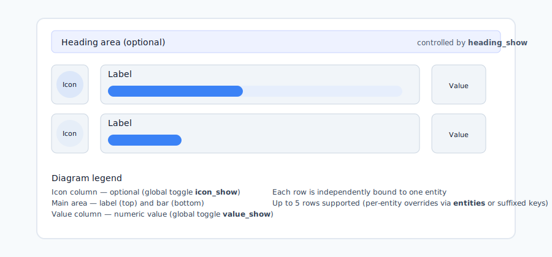

# Simple Bar Card — a compact, theme-aware Lovelace bar card

This repository provides a lightweight, single-file Home Assistant Lovelace custom card that visualizes numeric entity states as performant bars. Version v0.2.0-beta adds stacked multi-entity rows, an optional heading area, and improved theme/dark-mode compatibility.
----
## Development & TODO

Development notes, the prioritized TODO and short-term work items are tracked in `docs/TODO.md`. Examples are available in the `examples/` folder for quick copy/paste into Lovelace. Use `docs/usage.md` for concise implementation notes and testing tips.

Files:
- `docs/TODO.md` — compact, prioritized checklist for near-term work
- `examples/` — ready-to-use YAML snippets (single, multi, bipolar+thresholds)
- `docs/usage.md` — technical notes (inheritance, visibility flags, icon coloring)

## English
### Quick summary
- Purpose: display 1–5 entities as horizontal rows containing an icon, a label, a performant bar (scaled via CSS transform), and a numeric value.
- Design goals: small single-file distribution, Home Assistant theme friendliness, smooth animations (rAF + transform), and clear per-entity override model.
### Highlights (v0.2.0-beta)
- Multi-entity rows: up to 5 stacked rows.
- Optional heading area above rows (`heading_show`, `heading`).
- Global visibility toggles: `icon_show` and `value_show` (apply to all rows).
- Per-entity overrides: use `entities` array (recommended) or suffixed keys like `entity_2`, `min_2`, `icon_3`.
- Theme & dark-mode friendly: respects HA theme variables and supports explicit `--*-dark` fallbacks.
- Robust icon coloring: tries to apply computed color to inner SVG paths when necessary so icons match themes or `icon_color` config.
### Installation
Add `simple-bar-card.js` as a Lovelace resource (raw or via HACS). Then add the card in Lovelace YAML or via the UI.
### Example — single entity
```yaml
type: 'custom:simple-bar-card'
entity: sensor.energy_today
min: 0
max: 100
```
### Example — multiple entities (recommended)
```yaml
type: 'custom:simple-bar-card'
entities:
  - entity: sensor.temp_living
  name: Living Room
  - entity: sensor.temp_bedroom
  name: Bedroom
heading_show: true
heading: Temperatures
icon_show: true
value_show: true
```
### Example — suffixed keys (legacy/alternate)
```yaml
type: 'custom:simple-bar-card'
entity: sensor.temp_living
entity_2: sensor.temp_bedroom
name_2: Bedroom
icon_2: mdi:bed
heading_show: true
heading: Temperatures
*** End Patch
# Simple Bar Card
